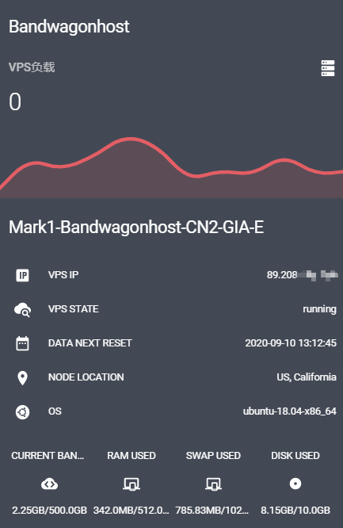

# BandwagonHost
用于home assistant平台的搬瓦工状态监视器,可以监视搬瓦工VPS的流量、内存、硬盘、负载和IP状态。  

## 安装
请将本项目中custom_components下的bandwagonhost文件夹复制到<config>/custom_components/文件夹下

## 配置 
```yaml
# configuration.yaml

sensor:
  - platform: bandwagonhost
    veid: BandwagonHost VPS veid          # 必须
    api_key: BandwagonHost VPS API_KEY    # 必须
    monitored_conditions:         # 可选
      - VPS_STATE                 # 可选，VPS运行状态
      - VPS_LOAD_1M               # 可选，VPS 1M负载
      - VPS_LOAD_5M               # 可选，VPS 5M负载
      - VPS_LOAD_15M              # 可选，VPS 15M负载
      - CURRENT_BANDWIDTH_USED    # 可选，流量情况
      - RAM_USED                  # 可选，已用内存
      - DISK_USED                 # 可选，已用硬盘
      - SWAP_USED                 # 可选，已用SWAP
      - VPS_IP                    # 可选，VPS IP
```
以上信息请从搬瓦工的控制页面获取。

## 效果示例


## 注意
为了防止因为api请求过于频繁而被搬瓦工封号，传感器每20分钟更新一次。
